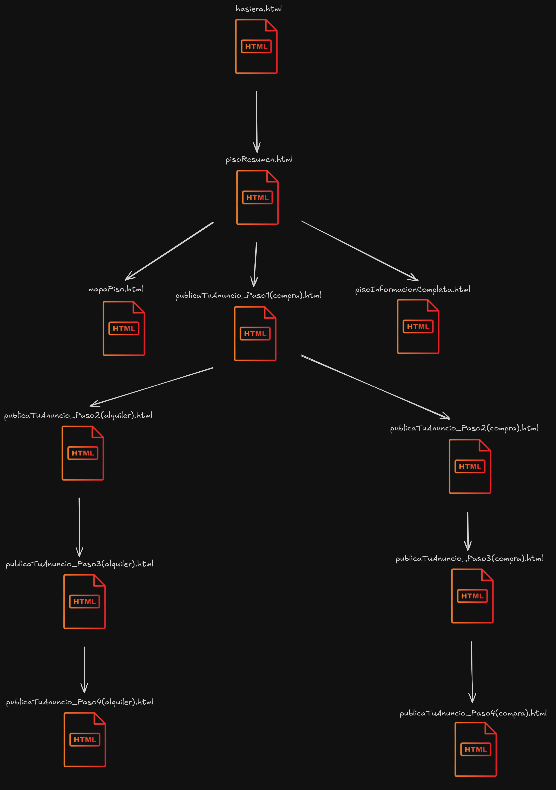

# Aurkibidea

- [UrbanNest Web Orrialdea](#urbannest-web-orrialdea)
- [Lehiakideen azterketa](#lehiakideen-azterketa)
- [Bozetoa](#bozetoa)
- [Nabigazio Mapa](#nabigazio-mapa)
- [Estilo gida](#estilo-gida)
- [Prototipoa](#prototipoa)

## UrbanNest Web Orrialdea Aurkezpena

> Web orri hau alokatu eta erosteko eraikin sorta zabala eskaintzean datza. Webgune hau aldi baterako erabili nahi dutenentzat edo zerotik hasi nahi dutenentzat da.

## Lehiakideen azterketa

> Web orri hau garatzeko, gure herrialdean garrantzia duten higiezinen hainbat atari ikertu ditut: JamesEdition, idealista, Pisos.com, Badi, Fotocasa beste askoren artean. Baina batez ere ezagunenetan oinarritu naiz, Idealista, Fotocasa eta Badi, hain zuzen ere.

**Erreferentzia nagusiak:**

- Orri nagusiaren diseinua (Badi)
- Pisuen laburpenak eta informazio laburtua (Idealista)
- Etxebizitzaren kokapenaren mapa (Fotocasa)
- Iragarkiak argitaratzea (Fotocasa)
- Aholkuak orrialdeetan (Idealista)

## Bozetoa

> Kolore-paleta aukeratzen hasi aurretik, eta web orri bati bizia eta forma emango dioten elementu guztiekin, ideia bat izan behar dugu buruan, edo, gutxienez, horren zati bat. Horretarako, ExcaliDraw erabili dut web-orriak izan dezakeen itxuraren zirriborroa marrazteko.

## Nabigazio Mapa 

> Hemen utziko dut nire web orriak izango duen nabigazio-mapa.

## Estilo gida

> Web orriari estiloa emateko, modelo moderno, minimalista eta arina erabiltzea erabaki dut, erabiltzaile guztientzat atsegina izango dena. 

- Kolore-paleta: 
    - Kolore primarioa (urdina/berdea): Ekintzara deitzeko botoietan, esteketan eta elementu interaktiboetan erabiltzen da, erabiltzailearen arreta erakartzeko.
    - Kolore sekundarioa (laranja): Botoi garrantzitsuetan erabiltzen da, hala nola "Jarri zure iragarkia hemen" eta "KONTAKTUA" kontraste eta ikusgarritasun handia sortzeko.
    - Atzealdearen kolorea (txuria): Edukia nabarmentzen laguntzen duen funts neutroa eta garbia eskaintzen du.
- Tipografia: Tipografia modernoa eta irakurtzeko modukoa da, eta tituluen eta gorputz-testuaren arteko hierarkia argia du.
    - Izenburuak eta goiburuak: Pisu handia duen sans-serif iturri bat erabiltzen da (ziurrenik Bold edo Semi-Bold). Tamainak aldatu egiten dira garrantziaren arabera, eta handiagoak dira esloganetan eta sekzio-tituluetan.
    - Gorputz eta paragrafoen testua: Iturria sans-serif arinagoa da eta letra-tamaina txikiagoa du, testu bloke luzeagoetan irakurtzea errazteko.
- Botoien itxura: Botoiek diseinu garbia eta modernoa dute, bi estilo nagusirekin
    - Lehen mailako botoiak: Kolore solidoko hondo bat dute, testu zuria eta ertz pixka bat biribilduak. Ekintza garrantzitsuenetarako erabiltzen dira.
    - Bigarren mailako botoiak: Kolore-ertz bat eta hondo zuri bat dituzte, eta testua ertzaren kolore berekoa da. Adibidez, "Erosi" botoia, "Alokatu" botoiarekin batera.
- Irudien erabilera: 
    - Irudien karrusela: Orrialde nagusiak pantaila osoko irudi-karrusela erabiltzen du propietate nabarmenak erakusteko, erabiltzailearen arreta hasiera-hasieratik bereganatuz.
    - Jabetza Irudiak: "Nabarmenena" atalean, jabetzaren irudi bat, izenburu bat eta testu deskribatzaile bat duten txartelak erabiltzen dira. Horrek ikusmenaren aldetik erakargarria eta antolatua den aurkezpena sortzen du.
- Ikono Estiloa
    - Estilo "linealeko" edo "outline" ikonoak: Ikono horiek diseinu sinplea eta garbia dute, lerro finak soilik erabiliz. Modernoak dira eta ez lukete diseinua gainkargatuko.

## PROTOTIPOA

> Azkenik, web orriaren prototipoa erakutsiko dizuet. Atal honetan pentsatzen da web-orriaren azken emaitza izango dela.

